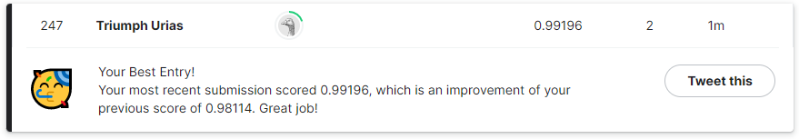

# Model 1

For this model, 2 convolution layers and 2 max pooling layers were used before flatten and dense layers. Image augmentation was also used as a technique to increase the training set size for better accuracy.

This model attained an accuracy score of ~99.16%.

