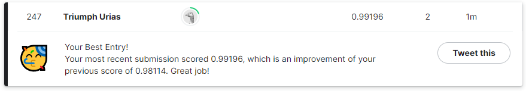

# Computer Vision (Image Recognition) On MNIST Digit Dataset

# Digit Recognizer

**Data Source:** [Kaggle](https://www.kaggle.com/competitions/digit-recognizer/data)

**Description:** The [Digit Recognizer](https://www.kaggle.com/competitions/digit-recognizer/overview) competition is for 
participants to build a supervised learning model that can recognize grayscale images of handwritten numbers ranging from 0 - 9.

**Result:** My initial submission got an accuracy of ~98.11% but by adjusting the parameters for my data augmentation, I
was able to move my accuracy higher to ~99.16%

*Submission Score:*

**Possible Area for Improvement:**

To improve my model's performance, I could train on the whole data set and eliminate a validation set. Thereby giving it 
a wider range of examples to train on. 